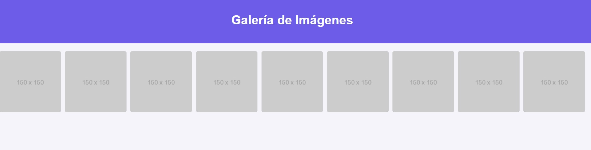

# Galería de Imágenes con Modal

Este proyecto es una galería interactiva de imágenes creada utilizando **HTML**, **CSS**, y **JavaScript**. Permite al usuario ver imágenes en una cuadrícula y ampliarlas al hacer clic, mostrando una versión más grande en un modal. El modal incluye la funcionalidad de cierre tanto con un botón como al hacer clic fuera de la imagen.

---

## 🌟 Características

- **Diseño responsive:** La galería se adapta a diferentes tamaños de pantalla utilizando un diseño de cuadrícula.
- **Interactividad:** Los usuarios pueden ampliar las imágenes al hacer clic y cerrarlas fácilmente.
- **Animaciones suaves:** Los efectos de hover y las transiciones mejoran la experiencia visual.
- **Modal dinámico:** Muestra la imagen seleccionada en alta resolución.

---
